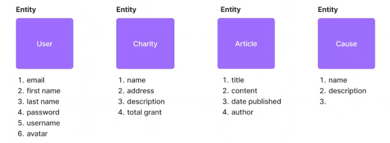

- [[Group-work 2: Marketing AI App]]
	- TODO 1 PM user map talk through on Figjam
	- TODO convert user journey to EPIC
	- TODO Define a data model
	- TODO Design a database
		- 1. similar to code along
		  2. for the project
	- [[Group-work: Charity Navigator]]
		- What Cause a Charity is following?
			- Back/End: Application Logic -> Database and Data Layer
			- Entity, Data Model, Supabase, PostgreSQL, Database Modeling
			- Figjam 
				- https://www.figma.com/file/ltzwhDpcyk0wFQRuk48ROt/Charity-Navigator-Entities?node-id=0%3A1&t=V5Ryr6TMT4WacfFn-0
			- Supabase:
				- Create a database -> save the password somewhere ->
				- Create tables based on entities
				- Table names are lowercase and plural
				- Table column names are lowercase, singular and if multiple words then snake_case
				- camelCase,
				- https://app.supabase.com/project/djhmrhhkgezyicxzlrsj/api?resource=articles
			-
			-
- review
- code along
- figjam by 2 2:30