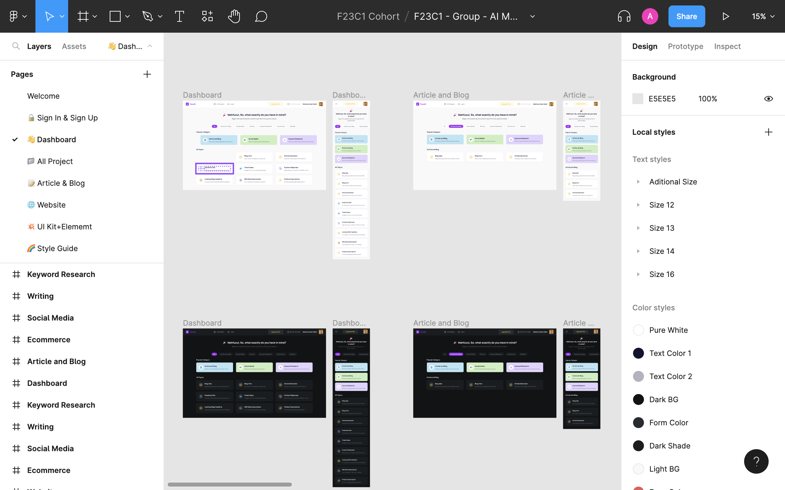
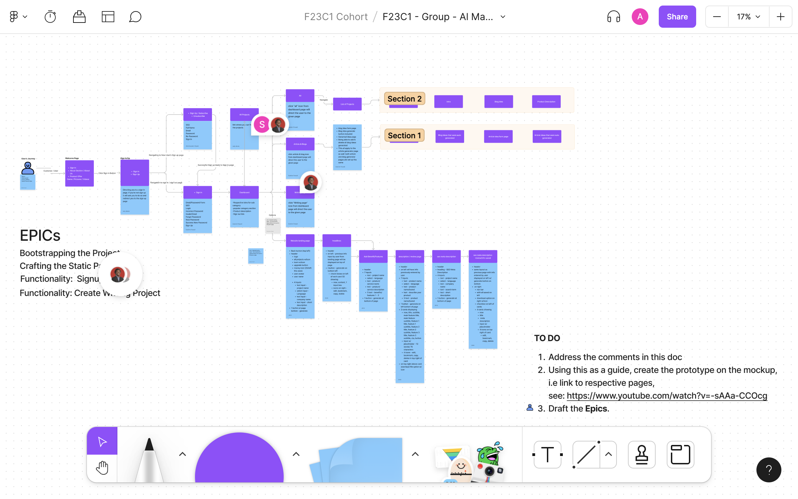

- [[Group-work 2: Marketing AI App]]
	- [[Figma]]
		- F23C1 - Group - AI Marketing App
			- https://www.figma.com/file/QEghK2yYc6BeQZOTWoigNt/F23C1---Group---AI-Marketing-App?node-id=443-34718&t=CQRY1CGvHRdG3zy5-0
			- 
		- F23C1 - Group - Al Marketing App - User Journey
			- https://www.figma.com/file/W6Bz9BTMgkKCcoCoXWpLab/F23C1---Group---Al-Marketing-App---User-Journey?node-id=0-1&t=FEYW8gsK7nh3yNWK-0
			- 
		- r shows comments #shortcut
	- [[EPIC]]
		- Bootstrapping the Project
			- Setting the project and tools
			- Creating the initial React frame
			- Getting everyone access from the Same repo....
		- Crafting the Static Pages
			- Static for all the pages, Dashboard, Welcome, Sign In/Out, etc...
		- Functionality:  Signup/SSO
			- Allowing a user to sign in to our app and bed redirected to a Dashboard
		- Functionality: Create Writing Project
			- Building the functionality for a user to "create" a writing project
		- TODO continue fleshing out EPICs
	- [[Issues]] to ZenHub