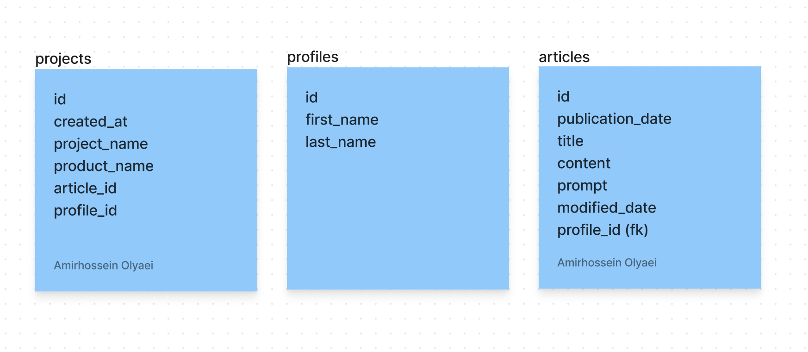
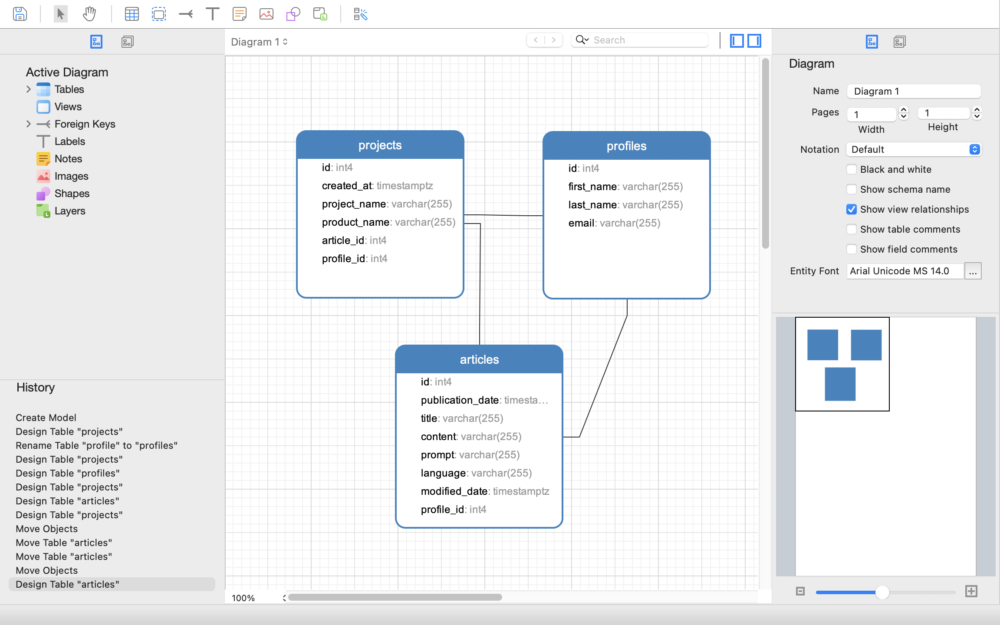
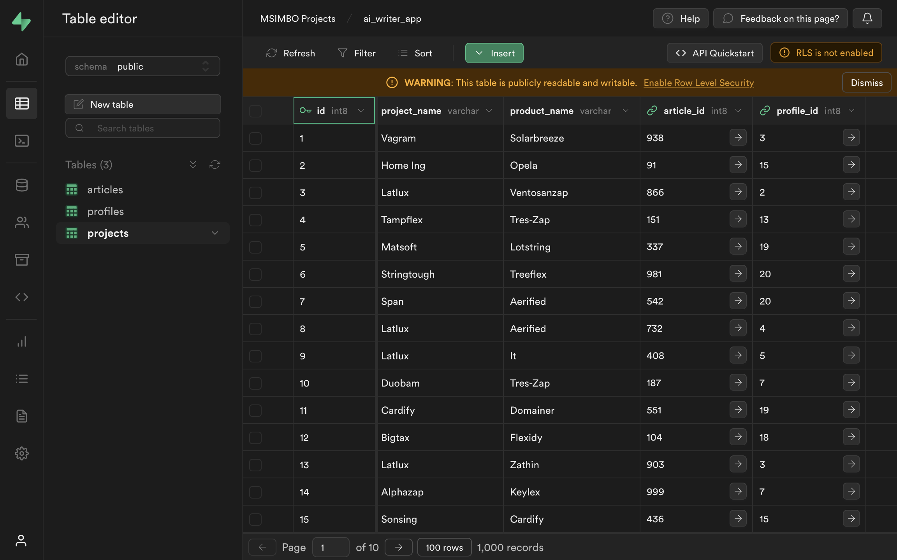
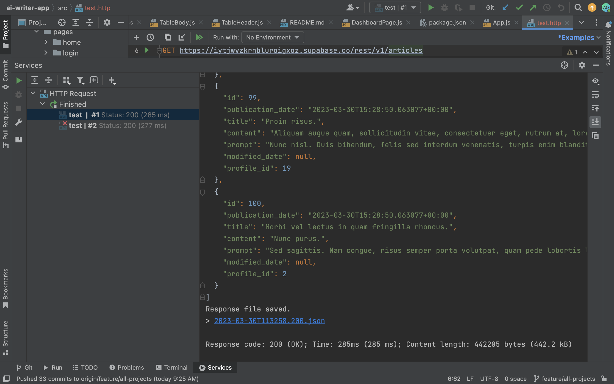

- [[Group-work 2: Marketing AI App]] # 77
	- **As a logged in user, I can see all my projects previously saved in the database**
	- Description:
		- The issue is about enabling logged-in users to view their previously saved projects from a database. Implementation should consider system architecture, user requirements, and thorough testing to ensure robustness and efficiency.
	- TODO Tasks:
		- Design draft model in [Figma](https://www.figma.com/file/mDq6Oc71KJAspqes7aPDYW/Supabase?node-id=0-1&t=3MA8yyUPHeDRvuKn-0)
			- connect with Darkim
			- For context,  [Amirhossein Olyaei](https://www.figma.com/files/user/857409693651239481) anytime a user create an "Article" we track it there as "type" article (linked with the FK) and the actual  content is stored in the articles
			- 
		- Design database model in Navicat (and transfer to Supabase)
			- 
		- Seed database with dummy data from mockaroo.com in Navicat
			- upload csv file first as a dataset
			- create new schema
			- 
		- Test projects API from webstorm
			- 
		- implement displaying projects from API/database queries
			-
	-
	- potluck on friday
	- stand up at 9am