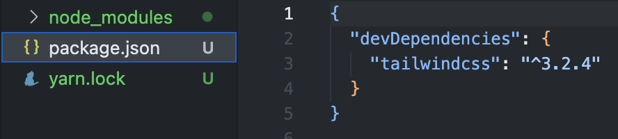
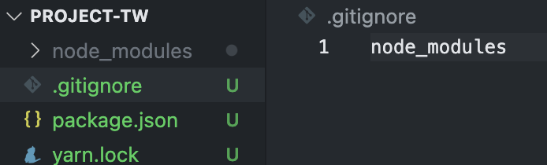
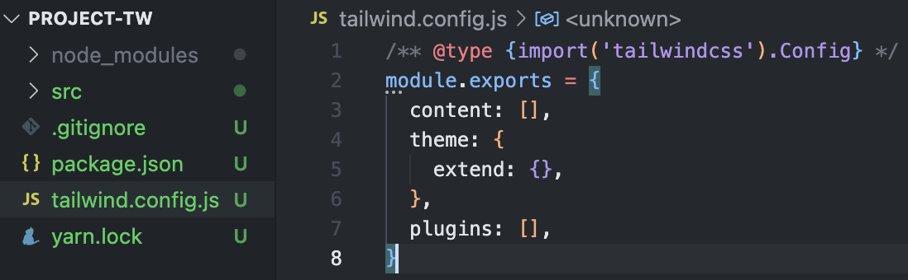
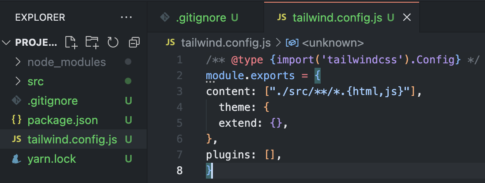
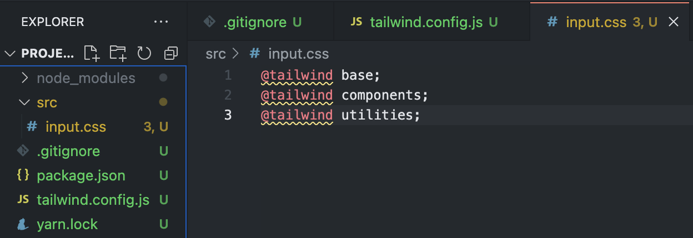

- Challenges:
	- How to solve real-world problems:
		- TODO Know Your Tools
		- TODO Your Web Presence
		- TODO The Windows Operating System
		- TODO The Mac Operating System
		- TODO The Internet
		- TODO Command-line
		- TODO HTML
		- TODO CSS
		- TODO JavaScript
		- TODO Capstone
		- TODO Labs
		-
	- How to start a Web Project
		- 1. Open my CLI interface, iTerm2
		- 2. Create a new folder called 'msimbo-projects'
		- 3. Then we 'cd' into the 'msimbo-projects' folder
		- 4. Create a folder called 'google-html'
		-
	- #CLI Commands
		- mkdir - make a directory
		- cd - changes into a directory
		- ls - list
		- ls -la - list in detail
		- cd .. - takes one directory back
		- rm -rf - remove folder w/ recursive force
		-
	- 2nd Fridays: Live Project Presentation
		- How you got your solution
		- How you collaborated with others
		-
	- #Markdown
		- [Markdown Cheatsheet](https://github.com/adam-p/markdown-here/wiki/Markdown-Cheatsheet)
			- [Link to my GitHub](https://github.com/AmirhosseinOlyaei)
			- >"quote"
			- 
			- #### Heading 4
			- **Bold** & _Italic_
			- * List
			  * List
			- 1. o list
			  2. o list
			- Two space at the end of the line, takes rest of the content to a new line
			- `Distinct Block`
			- ```
			  A few lines in a distinct block
			  B
			  ```
			- The background color should be `#ffffff` for light mode and `#0d1117` for dark mode.
			-
			-
			-
- input+btm+btn
- div*3 
  #+BEGIN_TIP
  
  #+END_TIP
- ctrl+command+d
- ! div+p
-
- #Git [reference](https://confluence.atlassian.com/bitbucketserver/basic-git-commands-776639767.html)
	-
	-
	- git branch feature/css-styling
	- git checkout feature/css-styling
	- touch style.css
	- git add . && commit -m "added an empty css file to a new branch"
	- git push -u origin feature/css-styling
	- git checkout main
	- git merge feature/css-styling
	- git add . && git commit -m "added an external CSS file"
	- git push -u origin main
-
- [SVG icons](https://heroicons.com/)
-
- In #search engine type "!gh"
- !g chrome color picker #extension #search
-
- in #vscode drag css tab to the side of window to have side by side windows with html
-
- #CSS file comments:
	- ctl + /
	- /* Link Typography */
	- /* Nav bar Layout */
	- select tags, ctrl+shift+p, wrap with emmet, name a tag
		- type # id=right in html
		- type #right in css file
-
- !yt create a ... #search in youtube
- sponsorblock #extension chrome
- DF tube #extension chrome
- #CSS tag: nav-bar {display:flex; justify-content: space-between;}
- #CSS tag: #right img, #right svg {width="20px"}
- #CSS tag: nav-bar #right {display: flex; justify-content: space-evenly;}
- #Git [show current branch in iTerm2](https://ohmyz.sh/#install)
- #Git comment as "fixes [#1](https://github.com/AmirhosseinOlyaei/google-html/issues/1) - adds the reset.css file"
- #Git [closing-issues-via-commit-messages](https://github.blog/2013-01-22-closing-issues-via-commit-messages)
-
- #Git issue template
- #search shareX download. Create a live gif link for windows
- #CSS `#footer div:nth-child(2){display: flex;}`
- #CSS import google.font into css file. define font families and size in rem
- #ssh authentication
	- ssh-keygen -t rsa
	- cat ~/.ssh/id_rsa.pub
		- copy results
	- #GitHub - Settings - #SSH keys tab - New SSH keys - paste here - copy after @ to the end of key - paste into the title area - Add SSH key
	- clone SSH link
	- chrome #extension Fonts Ninja
-
- emmet
- ```
  html
  ```
- ```html
  html code
  ```
- ```CSS
  ```
- Modular #CSS
	- #npm modules
	- css framework
	- advanced framework
	- design pattern that is repeatable
	- D. R. Y. => Do not repeat yourself
	- Documentation of a project
		- #icon https://ant.design/components/icon
		- #bootstrap https://getbootstrap.com/docs/5.3/getting-started/introduction/
		- #tailwindcss https://tailwindcss.com/docs/installation
		- #foundation https://get.foundation/
		-
	- command+k => search box
	- #codeeditor
		- https://jsitor.com/
			- extension, add library, paste tailwindcss CDN url
		- https://playcode.io/
		- https://codepen.io/
- mkdir xxx
	- touch index.html style.css
	- ```#main + #article + <div id="main">
	  #main + #article + <div id="footer">
	  ```
-
- #tailwindcss #CLI
	- #Node.js download LTS
		- `sudo npm i -g yarn` or `npm install -global yarn`
		- get in your project folder
			- ```
			  cd ULEM
			  cd msimbo-projects
			  mkdir project-tw
			  cd project-tw
			  ```
		- `sudo yarn add -D tailwindcss`
			- 
		- create the file `touch .gitignore`
			- type `node_modules` in .gitignore file
			- 
		- `npx tailwindcss init`
			- 
			- Configure your template paths. 
			  Add the paths to all of your template files in your `tailwind.config.js` file.
			- 
		- `mkdir src && cd src && touch input.css` or `tailwind.css`
			- 
		-
	- push to #GitHub
		- in #CLI , go up one folder (out of `src`),
		- initialize the `project-tw` folder.
		- ```
		  cd ..
		  git init
		  git add .
		  git commit -m "tailwind cli configuration"
		  ```
		- on GitHub, create a repository. `project-tailwind-config`
		- push an existing repository from the command line
		- ```
		  git remote add origin git@github.com:AmirhosseinOlyaei/project-tailwind-config.git
		  git branch -M main
		  git push -u origin main
		  ```
	-
	- Tailwind CLI build process:
		- `mkdir src && touch src/tailwind.css` already created this file
		- `npx tailwindcss -i ./src/tailwind.css -o ./css/styles.css --watch`
		- in `index.html` head: `<link href="/css/styles.css" rel="stylesheet">`
		-
		-
		-
-
- new project: `~/msimbo-projects/googlemini-calculator›` convert to celsius
- send the link of issues on sleck